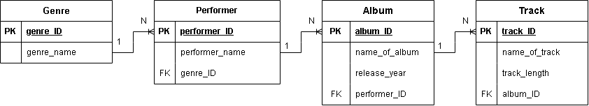
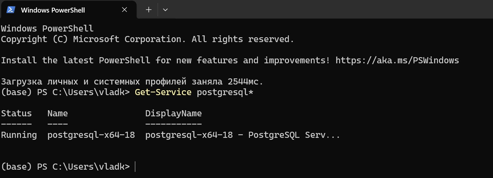
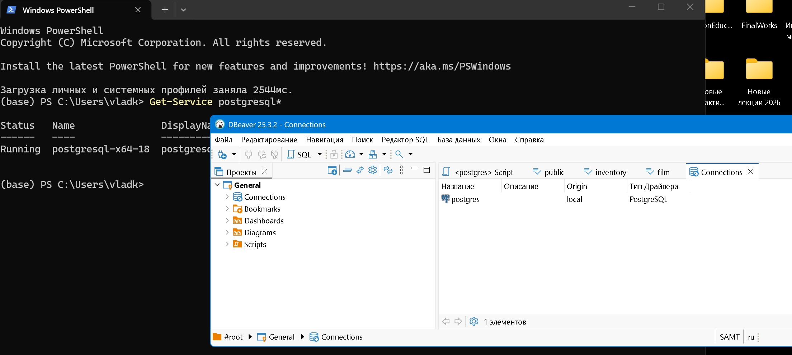

# Домашнее задание к лекции «Введение в БД. Типы БД»
**Студент: Корецкий В.П.**

## Задание 1 (практика)
Спроектировать схему — таблицы и связи между ними — для музыкального сайта. Требования:  
* на сайте должна быть возможность увидеть список музыкальных жанров;
* для каждого жанра можно получить список исполнителей, которые выступают в соответствующем жанре;
* для каждого исполнителя можно получить список его альбомов;
* для каждого альбома можно получить список треков, которые в него входят;
* у жанра есть название;
* у исполнителя есть имя (псевдоним) и жанр, в котором он исполняет;
у альбома есть название, год выпуска и его исполнитель;
* у трека есть название, длительность и альбом, которому этот трек принадлежит.  
  
**Схема базы данных**  

[Ссылка на png-файл](https://github.com/VladKoretski/music_db/blob/main/figs/music_db.drawio.png)

## Задание 2 (подготовка к следующей лекции)

Результаты установки PostgreSQL на ПК:  
**установлено**  

## Задание 3 (подготовка к следующей лекции) ##
Результаты установки программы DBeaver Community на ПК
**установлено**  

